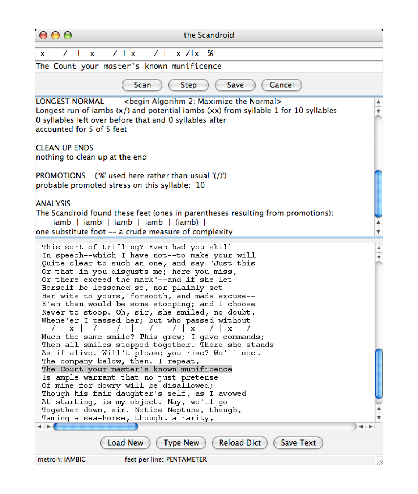

# the Scandroid

Note: Copied from the pdf file being converted to markdown format.

***Version 1.1***

http://cherry.conncoll.edu/cohar/Programs

Copyright © 2005 Charles Hartman

## About the Scandroid
The Scandroid is a program that scans metrical verse. If you don’t know what that
means, you probably don’t want the program. It has nothing to do with JPEG files or
police radios.
If you’ve used an earlier version of the Scandroid, you may want to look over this
manual anyway. Much has changed, including some keystroke commands. See the file,
``revisionhistory.txt``, for a brief rundown.

Copyright (C) 2005 Charles Hartman — This program is free software; you can redistribute it
and/or modify it under the terms of the GNU General Public License as published by the
Free Software Foundation; either version 2 of the License, or (at your option) any later
version. See the accompanying file, ``gpl.txt``, for full details.
This software is OSI Certified Open Source Software. OSI Certified is a certification mark of
the Open Source Initiative.

Part of the Scandroid’s purpose is to suggest that a program that scans metrical verse
may be an interesting idea: that its existence and successes and failures might repay
attention by a reader of poetry or literary critic or linguist. The program has
innumerable limitations. Here’s an important one:

*It deals only with English verse*. Its internal dictionary of syllables and stresses
contains only English words and, more subtly, only the kinds of information
relevant to English verse. The metrical rules and principles, too, are those of English.
French, Chinese, German or Greek would require not just a different dictionary but
a different program. (For one explanation, see Hanson and Kiparsky, “A Parametric
Theory of Poetic Meter,” *Language*, 1996, 72, 2, 287-335.)

The Scandroid is freely distributable under the terms of the GNU Public License. You
can give it away, use it in class, make it do your poetry homework for you, anything
you like. I ask you to credit it and me appropriately and send me any interesting
modifications. It’s written in the Python programming language. The source code is
available from the same place where you got the program.

I would be very happy to hear about the Scandroid’s successes and failures. Please send
bug reports, suggestions for new features, and interesting results you’d like to share to
me at: charles.hartman@conncoll.edu.


# 1. Installing the Scandroid
The Scandroid runs on either Macintosh (OS 10.3+ only) or Windows. Download the
archive appropriate to your computer. Make a folder for it, copy the archive there, and
double-click the archive to unpack it. To run the program, double-click the
“executable.” On Mac, the executable is the Scandroid icon (a detail from a portrait late
in life of General Henry Martyn Robert). On Windows, the executable is the file called
``Scandroid.exe``.

The program keeps some data in a dictionary file. On Mac, this is safely hidden away
inside the application. On Windows, it’s a separate file called scandictionary.txt. Keep
this file where the Scandroid can find it, and don’t mess around with it. If you defy
either of these admonitions, the program will still work, but it won’t work as well,
because it will be stupider than usual about how words are divided into syllables and
which syllables are stressed. See section 8: The Dictionary for details.

If you want to install the Scandroid on another system such as Linux, it shouldn’t be
very difficult, but you’ll have to build it from the source code, which is available in the
same place as the Mac and Windows archives. The program is written in Python and
wxPython (the versions used are shown in the startup screen). If you do this, I would
very much appreciate hearing about it.

# 2. The Window

<div style="text-align:center"></div>

When you run the Scandroid, you’ll see a window with several parts. The next page
shows an illustration of it. Here’s a list of the parts from top to bottom:

1. **Scansion line**. The results of the program’s calculations appear here, step by
step. You can’t edit them. (I’m not sure what the point of the program would be
if you could.)

2. **Line to be scanned**. This is also read-only (or almost; see 6: Fixing the Line).
You don’t type lines here. Instead, when you double-click a line in the Text
panel, it gets copied into this field to be scanned. (See 3: Quick How-To.) These
two one-line fields at the top of the window, 1. and 2., are sometimes referred to
in this manual as “the workboxes.”

3. **Scansion buttons**. These do the main business of the program. For details see 3:
Quick How-To. Most of them have menu equivalents with keyboard shortcuts.

4. **Notes panel**. This is where the Scandroid reports how it arrives at its
intermediate results so as to explain in some detail the marks that appear in the
scansion line. You can’t edit this, but you can select all or part of the notes for
copying to the clipboard and pasting in another program.

5. **Text panel**. This shows the poem—that is, the collection of lines to be scanned.
You can type lines in or, better, load a text file. The following section tells you
how, and the following section explains it in detail.

6. **Text buttons**. These are for handling text and files. Most of these buttons, too,
have menu and keystroke equivalents. For details see 4: Text Files.

7. **Status bar**. This keeps you posted about the current parameters, or conditions,
for scansion. It tells you whether the “metron,” the basic foot, is the iamb (x/) or
the anapest (xx/). If the program is assuming a regular line-length, the status bar
tells you how long the line is. If not, it informs you that line-length is being
treated as variable: the program will recalculate it, as best it can, for each line.


... work in progress ...
will be split in multiple files


# 3. Quick How-To
Here’s a summary of the basic steps in using the Scandroid. Later sections explain
variations, details, and background concepts. Reading those sections will make the
program more useful.

Most of the program’s actions can be controlled from its menus, and most of them have
keyboard equivalents. When the keyboard commands are mentioned here, “cmd”
means that you hold down your computer’s “command” modifier key—on Mac, the
Apple key; on Windows, Ctrl—while you press the relevant letter or number key.
1. Click the Load New button (or press cmd-L). In the resulting dialog, select a
plain-text file containing the lines you want to scan—a poem, presumably. (See 4:
Text Files for details.) One sample (Keats’s ode “To Autumn” is included in the
program archive.)
2. Double-click a line in the Text panel. This selects the line and copies it into the
work-box at the top of the window. There’s also an item in the Scan menu, “Next
unscanned line,” which finds the first line at or below the cursor that doesn’t
have a scansion directly above it. (They keyboard shortcut is cmd-1—the number
‘1’, not lowercase letter ‘L’.)
3. Click the Step button (or press cmd-T) to perform the first step in the scansion
process: dividing the line into syllables and putting a mark over each one in the
scansion work-box. In the Notes window you’ll see the name of this step
(SYLLABLES), followed by lists of words that the Scandroid found in its dictionary
and words whose syllabification it figured out from general principles. (You can
override its decisions; see 6: Fixing a Line and 8: The Dictionary.)
4. Keep clicking the Step button to follow the next stages in the scansion process.
There are around half a dozen steps; the number varies according to
circumstances. (See 5: What Happens When You Load a File and 9: Algorithms.)
If you want to skip straight to the conclusion of the scanning process for the line,
click the Scan button (or press cmd-2). All the explanations appear in the Notes
window as if you had gone through the steps one by one.
5. In case something seems wrong with the scansion, you can control several basic
assumptions the program makes:
    1. If it’s wrong about how a word is divided into syllables, or how it’s
stressed, double-click the word. Do this in the workbox—not down in the
Text panel! (That would just select the line again and restart the scansion.)
Follow the directions in the dialog box that comes up. (See 6: Fixing a Line
or details, and 7: Lexical Stresses and 8: The Dictionary for still more.)
    2. If the program is wrong about the metron—if it’s trying to scan as
iambic lines that you know are anapestic, or vice versa—you can force the
opposite choice the other way through items available in the Scan menu.
(For background, see 5: What Happens When You Load a File.)
6. When the scansion is complete, so that clicking Step has no further effect, you
can store the scansion down in the Text panel by clicking the Save button or
pressing cmd-3. This displays the scansion above the line it belongs to, and clears
both the workboxes. You can Save the scansion at any stage of scanning. If you
select the same line again and Save again, perhaps at a different stage, the new
scansion will replace the old one in the Text panel. (You can fool the program
into preserving multiple scansions; see the end of this section).
7. All your scansion results on a poem will disappear when you click Load New
again (or Type New). To preserve your work on disk, click the Save Text
button at the bottom of the window. In the dialog that comes up, supply a file
name. If you Save Text more than once and supply the same name, you’ll be
asked to confirm that you want to overwrite the existing file. The output is a
plain text file that can be loaded into any text editor or word-processing
program. You may want to set your editor’s font to a fixed-width one, such as
Courier, so as to preserve the alignment between scansion marks and the
syllables they belong with.

That’s all there is to the basic process. Here are some tricks that you might find useful.
You should browse through these, because some options are described only here.
1. You can scan a whole series of lines quickly by holding down your system’s
“command” key (Apple or Ctrl) and pressing the 1, 2, 3 keys repeatedly. This
selects the next unscanned line, scans it, and saves it back to the Text panel.
2. To quit scanning a line without saving the results in the Text panel, click the
Cancel button. Selecting a new line has the same effect.
3. An option in the Edit menu lets you turn ON line numbers in the display of
text in the Text panel, or turn them off again. They’re not smart: against the
convention for printing poetry, they include blank and title lines. That’s why
they’re off by default. Nor is there any way to save them when you save the file.
4. The text in the Text panel can be edited, though not while a line is selected for
scanning in the workbox at the top of the window. (This is to prevent
inconsistencies that could result if you were to edit the line that’s being scanned.)
As a result:  
    1. You can edit a line before you select it to be scanned. For example, if
something in the spelling or spacing in the lines confuses the program,
you can Cancel the current scansion, edit the line, and re-select it.  
    1. You can add notes of your own—to the lines, to the scansions saved
over them, or to the top or bottom of the whole text—which will be saved
to disk when you click the Save Text button.  
    1. This is also how you can trick the program into saving multiple
scansions: Save one, move the cursor to the right-hand end of it, and
press Return or Enter to make a blank line between the scansion and the
line it belongs to. Then re-select the line and scan it again (perhaps
progressing to a different stage or using different choices). When you click
the Save button again, the new scansion will be stored above the verseline as usual, but it won’t replace the scansion above the blank line you
created.
5. The text in the Text panel, the Notes panel, and the workboxes can be selected
and copied to the clipboard. From there it can be saved into another program
such as a text editor. This is not the easiest way to save what’s in the Text panel
(use Save Text), but it’s the only way to preserve what appears in the Notes
panel or workboxes as you scan each line. Normally the Notes for one line
disappear as soon as you select another line. To select and copy text, click inside
the panel to give it the focus, and then press your system’s keystrokes for “Select
All” and “Copy”—probably cmd/ctrl-A and cmd/ctrl-C.
6. The Edit menu includes a Find in text command (cmd-F) so that you can locate
words and phrases in the Text panel. It allows you to specify case-sensitive and
whole-word-only searches.

# 4. Text Files
The Text panel in the bottom half of the screen displays what we can call “the poem” for
short, if we assume that the reason you want to watch a program scan metrical lines is
that they belong to a poem you’d like to understand better. That might not be true. For
example, you might be interested in experimenting with a line to see what changes
make the program treat it as metrical or unmetrical.

The easiest way to get lines of verse into the Text panel is to press the Load New
button at the bottom of the window, and then, in the file dialog, select the file
containing the poem.

It should be a plain-text file. If you have the poem in a word processing program’s
format, choose your word processor’s “Save As” option and save it as “Text only.”
Word processors and operating systems differ in their terminology for this process, but
they can all do it.

In practice there are more and less pure “text only” or “plain ASCII” formats. If you
load a file into the Scandroid and see garbage, you’ve probably selected a file that isn’t
pure text. If the garbage is trivial and isolated, you might be able to ignore it; it won’t
bother the Scandroid unless it’s in the line selected for scanning. Or you might be able
to edit it out, because the text in this panel is editable (except while a line is being
scanned). The Scandroid can deal intelligently with a few non-ASCII characters; it takes
the ‘è’ in “fixèd,” for example, as a cue to give the word two syllables.

You can help the Scandroid behave properly by making sure that any title line at the
top of the file is indented with one or more Tab characters (not spaces—see the next
paragraph). This makes the program ignore the line at a key testing stage (see 5: What
Happens When You Load a File). The same is true of any author attribution or other
non-verse material at the bottom of the file, or section titles in the middle of it: make
sure they’re Tabbed in from the left margin. This doesn’t prevent you from doubleclicking such a line and scanning it, though the results are obviously unpredictable.

On the other hand, if lines in the poem are indented with a few spaces, as is conventional
in some stanzaic forms, this won’t bother the program. It will scan the line when you
select it, and when you Save the scansion it will be indented by the same amount, so
that it lines up properly over its text. If a line really belongs to the poem, and is
indented, make sure the indentation is done with spaces rather than Tabs.


# 5. What Happens When You Load a File
When you click the Load New button and select a text file, the Scandroid reads the
file’s lines into the Text panel and tries to deduce the basic metrical parameters of the
lines: whether the basic foot is the iamb or the anapest (the “metron”), and whether
there is a clear and consistent length (in feet).

(The term “parameters” is used here not because it’s programmers’ jargon, but because
it’s linguists’. “Parametric” theories propose that linguistic systems depend on the
“settings” of a relatively small number of “switches” in the learning infant’s brain: the
native language is left-branching or right-branching, does or doesn’t require every
clause to have a subject, and so on. On this theory, metrical systems are built up on top
of native linguistic ones, though more artificially and more nearly consciously. Different
metrical systems can be specified through the choices they embody for a small number
of variables. See the article by Hanson and Kiparsky listed above for one description.)

Experienced human readers determine the basic meter of a poem, such as iambic
pentameter or anapestic tetrameter, fairly easily. A reader who can do that, however,
finds it difficult to say exactly how. The program, which like any program is nothing if
not a declaration that we can say exactly how something is done, does not have an easy
time of it, and can make mistakes. This is why there are items in the Scan menu called
Force iambics and Force anapestics.

When you Load a text file, the Scandroid samples the first dozen lines. (A random
sampling of lines throughout the poem would produce less reliable results: poets
establish meters early in each poem, though not always at the very start.) Using a quick,
silent run-through, the program tries to scan each line as iambic and then as anapestic.
It tabulate the results and picks the metron that works more often.

Many lines that we recognize without thinking much about it as iambic could be
scanned as anapestic, and vice versa. To exclude these possibilities, it turns out, would
require restricting the meters in unrealistic ways. Poets’ practice includes lines that,
taken in isolation from their metrical context, might be construed as ambiguous.
Therefore, the “votes” the Scandroid collects are sometimes surprisingly close. They’re
closer with anapestic poems than with iambic ones. This is partly because of quirks
within the program, and partly, I suspect, for reasons having to do with the meters
themselves. The Scandroid guesses right most of the time, but not always.

This is one reason to be careful about title lines (and section titles, author attributions,
and so on). If the program doesn’t recognize them as titles because they don’t begin
with one or more Tab characters, it may include them in its sample of lines from which
to deduce metrical parameters. Their contribution isn’t likely to be helpful.

Having deduced the metron, the Scandroid goes on to determine the lengths of lines.
Deducing the line-length, too, turns out to be tricky. It’s more difficult with iambics
than with anapestics, probably because the dominance of iambic meters in English
poetry means—is both a cause and an effect of the fact—that the iambic is more flexible
and various. The best approach I have found is simply to average the lengths deduced
for each individual line (keeping separate averages for the iambic and anapestic trials,
of course). If the average is close enough to an integer, then the program declares that
line-length constant, and does all its scanning of the whole poem on that assumption. If
the average is not close—for example, if the poem alternates between anapestic
tetrameters and trimeters, like “The Hunting of the Snark,” so that the average is near
3.5—then the program doesn’t set a global line-length, but considers length to be
variable and recalculates it for each line.

The status bar at the bottom of the window reflects the results of these deductions. The
decision about the metron can be changed with a menu selection. The decision about
line-length can’t be changed, because allowing that doesn’t seem to help; this is a topic
for further research.

# 6. Fixing a Line
The Scandroid divides its work on a line into a series of steps. One crucial stage comes
early in the process when it decides how many syllables each word has, which syllable
is stressed in words with more than one, and whether a monosyllabic word is likely to
be stressed or not. The program decides these things sometimes by looking the words
up in its internal dictionary, and sometimes by figuring them out from general
principles. In either case, it can be wrong.

How can it be wrong if the word is in its dictionary? The things it needs to know about
words vary to some extent both geographically and historically. For example, Philip
Larkin, an English poet, hears the word “serious” as having two syllables (“SER ious”),
and some of his lines hardly scan at all if you give the word three syllables (“SE ri ous”),
as the American Heritage Dictionary insists. W. B. Yeats (Irish, 1865-1939) consistently
treats “being” as a monosyllable (“And Agamemnon dead. Being so caught up”), while
Edward Fitzgerald (English, 1809-1883) has lines that require “being” to have two
syllables in order to scan with the kind and degree of regularity typical of his other lines
(“Of Being from the well amid the waste”). Farther back in time differences accumulate,
and the dictionary built by an American in 2005 may need a substantial number of
adjustments to deal with English poetry of the seventeenth century.

Therefore, if the Scandroid gives up on a line or reports results that defy your linguistic
intuitions, the reason may be a problem with syllabification or stress, rather than some
elaborate complication in the poet’s use of meter. If you think this is the case, here are
the steps to take:
1. Double-click on the “wrong” word (in the workbox up top, not down in the
Text panel).

2. A dialog shows how the word is currently being divided into syllables and
which syllable is being stressed. Below that, in the dialog’s edit field, type the
word as you want the program to treat it: separate syllables with blank
spaces, and put the stressed syllable, if any, in ALL CAPS. (Don’t miss a letter
in capitalizing, or the stress won’t be recognized.) Type the other syllables all
in lowercase, even if the word is a proper noun beginning with a capital
letter; this won’t affect how the word appears in the line.

<div style="text-align:center"></div>

3. When you click OK in the dialog, the scansion field clears; the Scandroid is
ready to start the process over again, taking the dictionary-edited word into
consideration. Start pressing the Step button again to see how the results
change.

The syllabification that appears at the top of the dialog may come from the dictionary
or, if the dictionary has no entry for that word, from the program’s internal
syllabification and stressing routines. In this case, when you enter a new treatment for
the word and press OK, a new entry in the dictionary is created. It lasts, however, only
for the duration of the current session; the Scandroid’s default, startup dictionary isn’t
altered.

If this editing of the dictionary helps, then either you’ve corrected a piece of ignorance
on the part of the Scandroid (hardly surprising), or you have discovered something
interesting about the usage of a word by this poet in this poem.

Because the reasons behind this word-editing option have so much to do with
idiosyncrasies in poets’ dialects or with historical developments, a change you make
this way is not stored in the program’s dictionary. It applies to any line that contains the
changed word for as long as the program runs in a single session. If you reload the
same poem another time, you’ll have to make the correction again. Eventually, if it
seems there is a need for it, a dictionary-editing system could be added to the program,
but it’s not obvious that it should be.

There’s one more twist on this dictionary-editing process. Some words are entered in
the dictionary with ambiguous stresses. You can add or remove this marking in the
dictionary-editing dialog. See 8. The Dictionary. Before an explanation of how to do
this will make sense, however, the next two sections must give some more background.

# 7. Lexical Stresses
“Lexical stress” is a term used by linguists in a fairly strict way. (See Paul Kiparsky,
“The Rhythmic Structure of English Verse,” Linguistic Inquiry, 1977, 8, 2, 189-247.) As
the Scandroid simplifies it, it means one of two things. The primary stress on a
polysyllabic word—which you can look up in a dictionary—is a lexical stress. So is the
stress on a monosyllabic word that belongs to an “open class.” Open-class words are
“content words”; closed-class words are “grammar words.” A class of words is “closed”
if we speakers of a language almost never make up new members of it. I can’t invent a
pronoun, and you can’t either (though together we are slowly creating a gender-neutral
singular pronoun “they”). “Open class” words, on the other hand, belong to categories
we extend much more easily—for instance, by coining new verbs from the nouns
“purpose,” “impact” and “contact,” all examples from the twentieth century. Lewis
Carroll can make up “slithy” and “toves,” and not bewilder us too badly, because he
can rely on words like “’Twas” and “and.” You can get a feel for the difference by
considering how many words you know in the category. Prepositions? a couple of
dozen. Nouns? tens of thousands.

The second step in the Scandroid’s procedure, which is the first time the ‘x’ and ‘/’
marks for slack and stressed syllables appear in the scansion, shows the lexical stresses
in the line. Any syllable stressed here is either the primary stress on a polysyllable or a
monosyllabic word that the program does not recognize (from its dictionary) as
belonging to a closed class. (Promoted stresses may turn up later on.) It’s often
interesting—perhaps especially for readers who are used to hearing the full metrical
pattern—to look at the bare lexical-stress representation of a line. Larkin’s “Or will he
be my representative,” for example, contains only one unambiguous lexical stress.


# 8. The Dictionary
The Scandroid’s dictionary is a bag of exceptions. The program includes routines that
can divide a word into syllables and, if there’s more than one, decide which is stressed.
The syllable-division procedure is built on principles described by Paul Holzer long ago
(Byte Magazine, 1986, 11, 2, 224-225), with additions and tweaks. It makes trivial
mistakes all the time (“lett-ing” rather than “let-ting”). But it avoids serious mistakes—
mistakes that would noticeably alter the appearance of the scansion—less than 10% of
the time. It has no trouble with “slithy” or “toves.”

The program’s mistakes in guessing the stressed syllable are more frequent, about 20%.
The program depends on a very simple method (see Bernstein and Nessly,
“Performance Comparison of Component Algorithms for the Phonemicization of
Orthography,” acll.ldc.upenn.eu/P/P81/P81-1004.pdf) known as Nessly’s Default.
Most polysyllabic words are disyllables, of course; Nessly’s Default crudely assumes
that they are front-stressed (like “crudely”), which is usually right but by no means
always (“assumes”). Careful work with suffixes and prefixes reduces the errors, but
can’t eliminate them. To see why it is impossible to remove all such errors—and
therefore impossible to eliminate the need for some kind of dictionary—think about the
words “reach” and “react.”

The dictionary, therefore, contains a few hundred polysyllabic words that (1) defy the
routines by which the Scandroid tries to dissect them and (2) have seemed to turn up
frequently in poems. It also contains, as exhaustively as possible, all closed-class
monosyllables: all pronouns, conjunctions, and so on. The Scandroid can then assume
that any monosyllable not in its dictionary should be stressed.

There are at least two major flaws in this system, one resolved and one not. First, there
are ambiguities: is “can” an auxiliary verb (almost never stressed), or a transitive verb
or a noun (almost always stressed)? The Scandroid includes a mechanism for taking this
possibility into account. (The mechanism depends on having a method of measuring
the relative success of two scansions. See 9: Algorithms.)

To support this solution to the gaps in the system, some entries in the dictionary include
indications of ambiguous stress. Monosyllabic examples include words like “that”: when
it’s a demonstrative pronoun (“Follow that cab!”), it’s usually stressed; when it’s a
relative pronoun (“I forgot that you were inside!”), it’s almost never stressed. The
Scandroid understands nothing about syntax, and has no way to distinguish these two
uses of the word. The solution—not ideal, but the best available within this design—is
to mark “that” as ambiguous. Its dictionary entry looks like this:
```
that            that*
```
The first “word” is the actual spelling, and the second is the syllables-and-stress code.
The entry for a normal polysyllable would look like this:

```
normal          NOR mal
```

As is shown here, monosyllables are marked as ambiguous with an asterisk at the end.
There must not be a blank space between the word and the asterisk.

Stress-ambiguous polysyllables are entered in the dictionary all in lowercase:
```
convict         con vict
```
In this case the stress pattern is ambiguous because either syllable might be stressed,
depending on whether the word is a noun (CON vict) or a verb (con VICT).

You can add these markings for stress-ambiguity to a word’s entry in the dictionary by
selecting the word so as to bring up the dictionary-editing dialog. Sometimes the results
are unexpected, but there’s no harm in experimenting. If you don’t like what happens,
you can select the word again and edit it back to the way it was. (Even if you’ve
forgotten how it was, all is not lost. When you quit the program, your dictionary edits
are abandoned; when you restart it, it will be with the original dictionary. Or simply
press the Reload dict button.)

You can also remove markers for ambiguity when they appear in the top field of the
dictionary-editing dialog. If you change don’t* to don’t then “don’t” will never be
treated as emphatic, but always as a simple auxiliary.

If a word has two unmistakable lexical stresses in it (which generally happens only with
compounds that are typographically run together as a single word), you can enter more
than one ALL CAPS stressed syllable, and the program will recognize them. HEAD line
is probably not a good example, but MAN KIND might be.

The way the Scandroid uses these stress-ambiguity markings is described in more detail
in the next section.

The second, unresolved problem with the Scandroid’s approach to lexical stress is that
there are “lexical” units that don’t look like single words typographically. (The
Scandroid knows only typography. Though it deals with fundamentally auditory
aspects of language, it’s deaf as a post. Even worse, it knows nothing about syntax, and
can’t parse a sentence to find out what role a word like “can” or “that” is playing.)
Particularly important and difficult among these two-token words are “phrasal verbs,”
so vital to idiomatic English. Because we make such significant distinctions among
“caught up,” “caught out,” and “caught on” (or “put out / up / in / on / over / off /
through / down / away . . .”), the stress within these pairs tends to fall at least as much
on the second word, the particle or adverb, as on the verb itself. But what is the
program to do with a line like this from Browning?
```
But to myself they turned (since none puts by
```
Entering “BY” into the dictionary as stressed would be silly (“sit BY the sea”?). We
could include “put by” in the dictionary and look for it whenever we find “by,” but we
would also have to include “puts by,” and look for both forms whenever we find “out,”
“up,” “over,” and so on, too. We would still have no way to identify a phrasal verb in
“put money by” or distinguish it from “put money by the door.” Another alternative is
to treat those particles as ambiguous in stress, conflating this problem with the previous
one. Research is under way to see if this approach has any promise.

You might find that you edit the dictionary while working on one poem, and then when
you load a different poem, discover that the edits are idiosyncratic to the previous poem
and get in the way with the new one. That’s why there’s now a Reload Dict button: it
throws out all your edits and loads the default dictionary as if you had restarted the
program.

# 9. Algorithms
Most of this section, which describes how the program goes about scanning lines, has to
do specifically with iambic verse. A brief note at the end says the little that needs to be
said about the internal operations of scanning anapestics. For a really detailed look at
how the program does what it does, you’re welcome to examine the Python source
code.

The Scandroid has not one but two approaches to the central problem of scanning an
iambic metrical line. The two procedures, or algorithms, begin the same way, diverge in
their middle stages, and come together again at the end.

The program always starts by identifying syllables and lexical stresses (see 7. Lexical
Stress), provisionally considering all other syllables as unstressed. This gives it a
preliminary sequence of stress-and-slack marks to work with. Then it figures out how to
group these preliminary marks into feet; this is where the two methods differ, as
described below. After that it checks for promoted stresses: syllables not prominent in
the speech-rhythm of the line but emphasized through the influence of the abstract
metrical pattern. Finally, it reports the inventory of feet into which it has divided the
line.

The first algorithm for dividing the line into feet goes farther back in the program’s
history than the second. I think of the first as Corral the Weird. It begins by looking at
the ends of the line for the tricky variations that seriously disrupt the unstressed /
stressed alternation of the iambic norm, especially variations that change the line’s total
length in syllables. It marks off the exceptional start of a “headless” line, and the
exceptional end of a line that has extrametrical unstressed syllables tacked on. (This
includes not only the amphibrach [x / x] of the standard “feminine ending” and the
second paeon [x / x x] of triple-rhyme endings like “intellectual” and “hen-pecked you
all,” but also an extra slack appended to other standard substitutions for the iamb: the
anapest, yielding a third paeon [x x / x]; and the spondee, yielding a palimbacchius [/ /
x].)

Once it has rationalized the line to this extent, the algorithm inquires whether the part
that remains can be treated as “normal” in the following sense: It begins with the total
number of feet in the line (five for a pentameter); subtracts the number of feet just
marked off by special treatment of the ends; multiplies by two, for the two syllables of
the iambic foot; and checks whether the result equals the number of syllables
remaining. If too many syllables remain, it searches for one or more anapests (x x /),
because each anapest substituted for an iamb adds a syllable. If too few syllables
remain, it searches for a “defective foot,” an isolated stress with no preceding
unstressed syllable (which usually happens after a caesura).

This algorithm is highly successful. I’ve seen it work with all the lines in Yeats’s “The
Second Coming,” which is hard. It’s also unwieldy, picky, and perhaps
counterintuitive. During development of the Scandroid, I discovered an alternative that
is somewhat less successful in its basic form, but in some sense more recognizable.

This second algorithm, which could be called Maximize the Normal, begins with a
search for the longest run of syllables in the line that is iambic or can easily be treated as
iambic. This includes, for example, all of the sequence ‘x x x /’ but only the second half
of ‘/ / x /’. The preference for including “pyrrhic” stretches (x x) but not “spondaic”
ones (/ /) derives from the fact that “lexical stress” often understates but never
overstates the number of stresses that will ultimately appear in the scansion.

Having located that regular center, this algorithm tries to divide the leading and trailing
remainder of the line, if any (sometimes the whole line is regular enough), into simple
groups of syllables that make plausible feet.

The second algorithm is not very good with anapests or defectives. It could be further
tuned if more techniques from the first algorithm were grafted onto it. Ultimately, the
two might be combined, though it is not certain that this would preserve their separate
successes or eliminate their failures. Incremental improvement in rule-based scansion is
tricky. Often an adjustment made to accommodate one variation creates a gap that
another variation slips through.

Though the analogy is far from exact, it’s interesting to compare the first algorithm with
traditional literary methods of scansion, and the second with approaches to meter
explored by linguists, especially generative phonologists, since the late 1970s. The
former approach concentrates on feet; it begins almost as much from the analyst’s
arsenal of foot-types as from the facts of language and the movement of the line. It is
highly effective, but tends toward the atomistic. The line may come to seem like a
collection of more or less exceptional specimens. The second algorithm is comparatively
lackadaisical about feet. Instead, it seeks an extended correspondence between lexically
stressed syllables on the one hand, and alternating stress-positions on the other. In this
regard it follows a principle central to Kiparsky’s approach: banning lexical stress in a
“metrically weak” position. Kiparsky’s metrical positions are strictly numerical, odd
and even in the line corresponding to weak and strong. (He makes other adjustments
for headless lines and trisyllabic feet.) The Scandroid’s second algorithm, by contrast,
just walks up to the line with as long an iambic ruler as possible and tries to match it
somewhere, odd or even. The result is similar.

Without the improvements one could make in it, the success rate of the second
algorithm on Larkin’s “Church Going,” a difficult poem metrically, is around 90%. This
is not as good as the first algorithm (near 100%, depending on lexical details). In general
the two algorithms differ on about 10% of scansions. The number of iambic pentameter
lines that elude both of them is quite small. Investigation so far suggests that almost
every instance in which this happens is traceable to difficulties at the lexical-stress stage.
(See 6. Fixing a Line, and 8. The Dictionary.)

The Scandroid chooses between algorithms as follows. It parses the line into words,
assigning syllables and stress to each word either as given in the dictionary or as
calculated by its own syllabification routines. It may encounter stress-ambiguities, as
described in 8. The Dictionary. The program constructs all the resulting hypothetical
preliminary scansions. (If there’s one ambiguity, it builds two alternative lines of
preliminary marks; if there are two, it builds four alternatives.) It tries out—silently and
behind the scenes—both algorithms on every combination of preliminary lexical marks.
It chooses the best combination of algorithm and stress-resolution alternative, or
chooses at random from among several “best” combinations. “Best” means most
regular, lowest in complexity according to a calculation that is partly arbitrary and
certainly subject to question. Because of the random choice it makes when alternatives
are equally good, scanning the same line twice can result in slightly different scansions
of equal complexity.

A couple of items in the Scan menu allow you to force the choice between algorithms.
You might want to do this if you were interested in how they differ. These menu items
are enabled only when you’re at the end of the “Choose Algorithm” step. Earlier they
wouldn’t make any sense; later, you’d be changing horses in midstream. If the program
tries an algorithm which fails, it briefly indicates why and then goes on to try the other
one.

The Scandroid’s treatment of anapestic lines is like a combination of the two iambic
algorithms. It begins by examining the alternative lexical-stress sequences that result
from resolving each stress-ambiguity each way. Once it has a plausible line of
preliminary marks, it looks first for an exceptional foot at the end of the line that ends in
a slack syllable, which may indicate either a final amphibrach (or paeon) or a promoted
stress. Then it checks the length of what remains to see how many disyllabic
substitutions for the trisyllabic anapest are required. This yields a collection of twos and
threes, and the program tries out each order of this abstract collection until it finds one
in which each two- or three-syllable chunk ends on a lexical stress. It identifies the feet
resulting from this division of the line’s syllables, checks that all of them are legitimate,
and makes a few final adjustments.

This appears to be an adequate approach for most anapestic lines. The program’s only
other twist is an early search for stretches of four or five apparently unstressed
syllables, which will defeat any scansion that relies on the foot being anchored by a
lexical stress. If the program finds a long run of slacks, it picks one for promotion,
which can then anchor a foot.